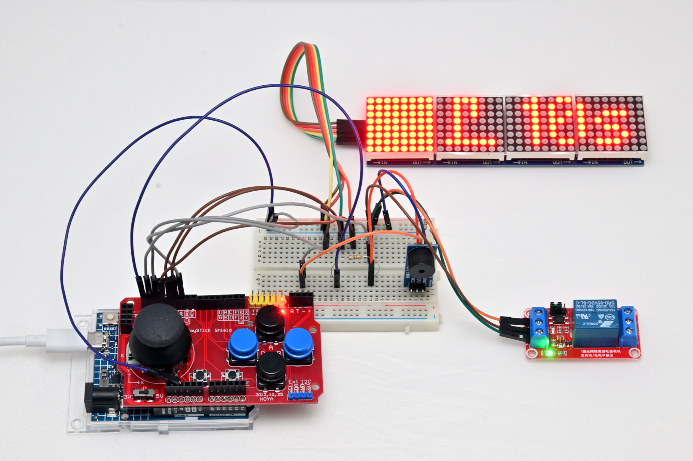
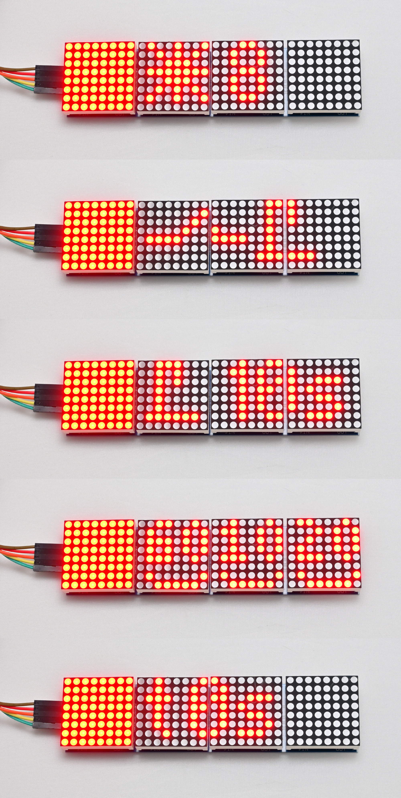
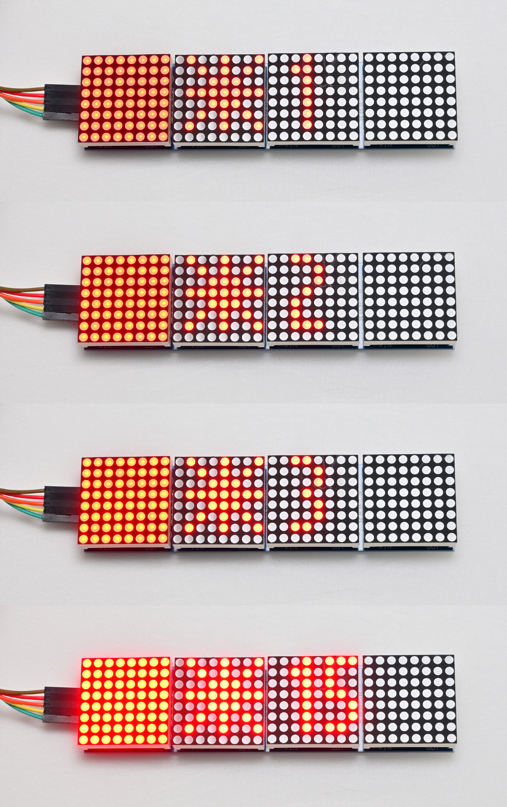
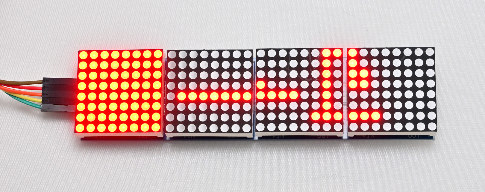
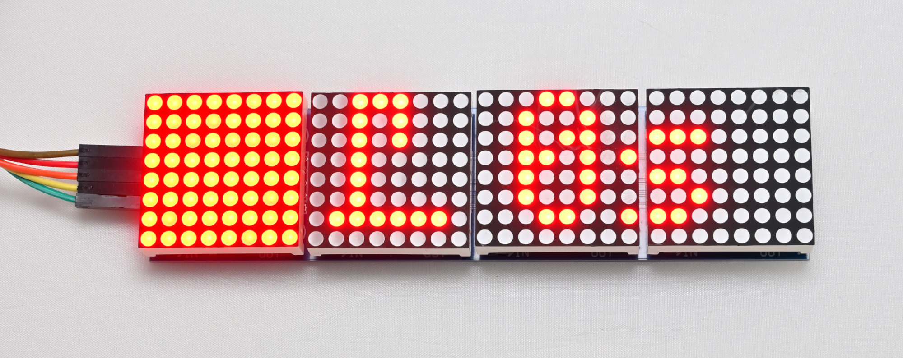
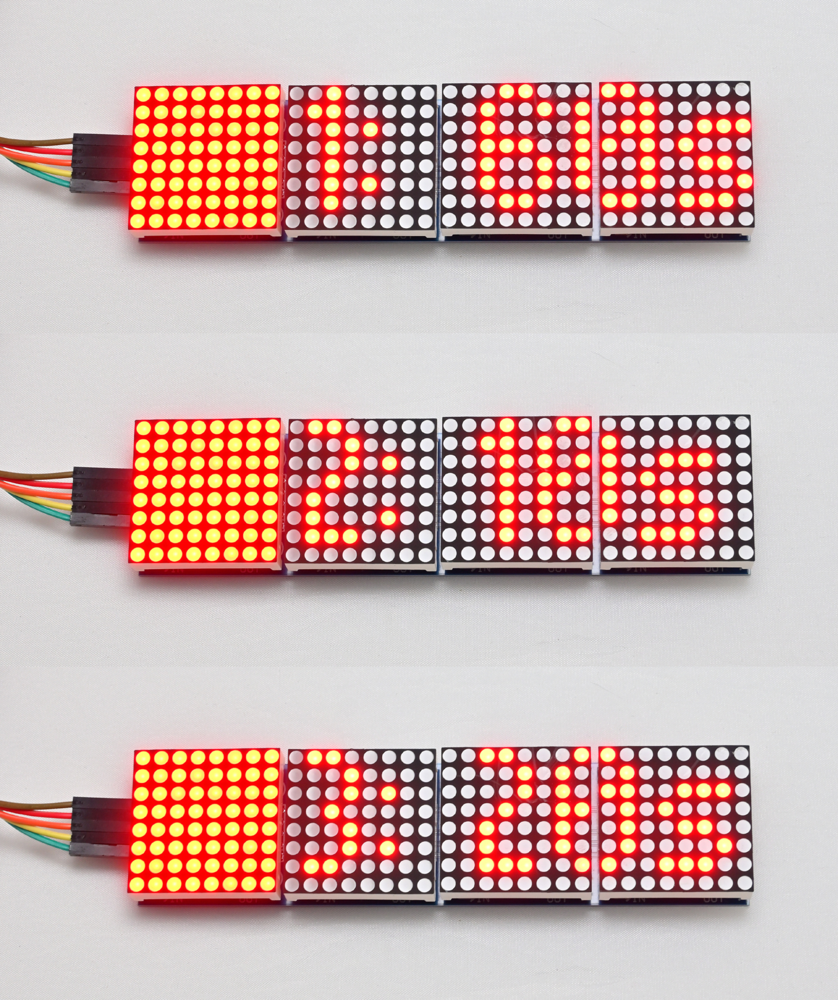
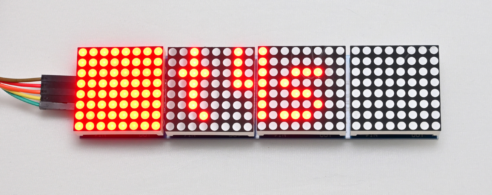

# Arduino Darkroom Timer

  

https://github.com/user-attachments/assets/7a2ae1d2-c87a-452d-9ca1-876dc4518d32

Uses the Gamepad Input shield and Arduino Uno R4. Wiring info is in the src.  
Up/down button/joystick changes task, and left/right button/joystick changes state/setting.  

With the first 8x8 LED block to illuminate the darkroom.  

Implements 5 tasks
- LEDBrightnessTask
- EnlargerOnOffTask
- EnlargerTimerTask
- DevelopStopFixTask
- GeneralTimerTask

  

## LEDBrightnessTask
Sets the brightness of the 8x8 darkroom illumination LEDs from min 0 to max 15.

  

## EnlargerOnOffTask
Manual enlarger switch switched on.

  

## EnlargerTimerTask
Timed enlarger switch.

  

## DevelopStopFixTask
3 timers for develop, stop bath and fix.

  

## GeneralTimerTask
General timer starting from 0s.

  

